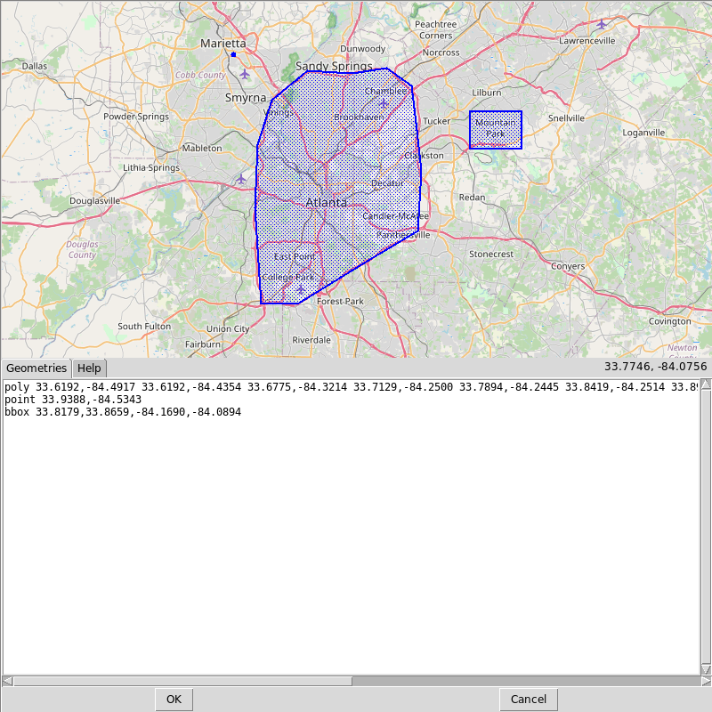

.. toctree::
   :caption: Table of contents
   :hidden:

   index

GetOSM
======

GetOSM is an OpenStreetMap downloader written in Python that is agnostic of GUI frameworks.
It is used with `tkinter <https://docs.python.org/3/library/tkinter.html>`_ by `ProjPicker <https://github.com/HuidaeCho/projpicker>`_.

Requirements
------------

GetOSM uses the following standard Python modules:

- `sys <https://docs.python.org/3/library/sys.html>`_
- `math <https://docs.python.org/3/library/math.html>`_
- `urllib.request <https://docs.python.org/3/library/urllib.request.html>`_

Installation
------------

GetOSM is available at https://pypi.org/project/getosm/.

.. code-block:: shell

   pip3 install getosm

Demo GUIs
---------

osmtk: tkinter demo GUI
^^^^^^^^^^^^^^^^^^^^^^^

`osmtk.py <https://github.com/HuidaeCho/getosm/blob/master/getosm/osmtk.py>`_

   osmtk: tkinter demo GUI

osmwx: wxPython demo GUI
^^^^^^^^^^^^^^^^^^^^^^^^

`osmwx.py <https://github.com/HuidaeCho/getosm/blob/master/getosm/osmwx.py>`_

License
-------

Copyright (C) 2021 `Huidae Cho <https://faculty.ung.edu/hcho/>`_

This program is free software: you can redistribute it and/or modify it under the terms of the GNU General Public License as published by the Free Software Foundation, either version 3 of the License, or (at your option) any later version.

This program is distributed in the hope that it will be useful, but WITHOUT ANY WARRANTY; without even the implied warranty of MERCHANTABILITY or FITNESS FOR A PARTICULAR PURPOSE.
See the GNU General Public License for more details.

You should have received a copy of the GNU General Public License along with this program.
If not, see <https://www.gnu.org/licenses/>.

getosm module
-------------

.. automodule:: getosm
   :members:

Indices and tables
------------------

* :ref:`genindex`
* :ref:`modindex`
* :ref:`search`
